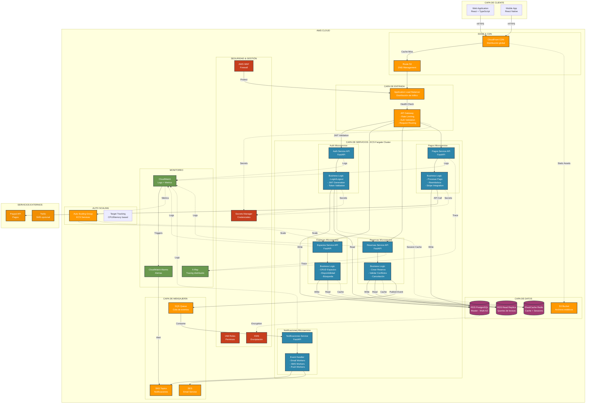

# Diagrama de Arquitectura del Sistema de Reservas

```mermaid

graph TB
    subgraph "CAPA DE CLIENTE"
        WebApp[Web Application<br/>React + TypeScript]
        MobileApp[Mobile App<br/>React Native]
    end

    subgraph "AWS CLOUD"
        subgraph "EDGE & CDN"
            CF[CloudFront CDN<br/>Distribución global]
            R53[Route 53<br/>DNS Management]
        end

        subgraph "CAPA DE ENTRADA"
            ALB[Application Load Balancer<br/>Distribución de tráfico]
            APIGW[API Gateway<br/>- Rate Limiting<br/>- Auth Validation<br/>- Request Routing]
        end

        subgraph "CAPA DE SERVICIOS - ECS Fargate Cluster"
            subgraph "Auth Microservice"
                AuthAPI[Auth Service API<br/>FastAPI]
                AuthLogic[Business Logic<br/>- Login/Logout<br/>- JWT Generation<br/>- Token Validation]
            end

            subgraph "Espacios Microservice"
                EspaciosAPI[Espacios Service API<br/>FastAPI]
                EspaciosLogic[Business Logic<br/>- CRUD Espacios<br/>- Disponibilidad<br/>- Búsqueda]
            end

            subgraph "Reservas Microservice"
                ReservasAPI[Reservas Service API<br/>FastAPI]
                ReservasLogic[Business Logic<br/>- Crear Reserva<br/>- Validar Conflictos<br/>- Cancelación]
            end

            subgraph "Pagos Microservice"
                PagosAPI[Pagos Service API<br/>FastAPI]
                PagosLogic[Business Logic<br/>- Procesar Pago<br/>- Reembolsos<br/>- Stripe Integration]
            end

            subgraph "Notificaciones Microservice"
                NotifAPI[Notificaciones Service<br/>FastAPI]
                NotifLogic[Event Handler<br/>- Email Workers<br/>- SMS Workers<br/>- Push Workers]
            end
        end

        subgraph "CAPA DE DATOS"
            RDS_Master[(RDS PostgreSQL<br/>Master - Multi-AZ)]
            RDS_Replica[(RDS Read Replica<br/>Queries de lectura)]
            Redis[(ElastiCache Redis<br/>Cache + Sessions)]
            S3[S3 Bucket<br/>Archivos estáticos]
        end

        subgraph "CAPA DE MENSAJERÍA"
            SQS[SQS Queue<br/>Cola de eventos]
            SNS[SNS Topics<br/>Notificaciones]
            SES[SES<br/>Email Service]
        end

        subgraph "SEGURIDAD & GESTIÓN"
            SM[Secrets Manager<br/>Credenciales]
            IAM[IAM Roles<br/>Permisos]
            WAF[AWS WAF<br/>Firewall]
            KMS[KMS<br/>Encriptación]
        end

        subgraph "MONITOREO"
            CW[CloudWatch<br/>Logs + Metrics]
            XRay[X-Ray<br/>Tracing distribuido]
            CWAlarms[CloudWatch Alarms<br/>Alertas]
        end

        subgraph "AUTO SCALING"
            ASG[Auto Scaling Group<br/>ECS Services]
            TargetTracking[Target Tracking<br/>CPU/Memory based]
        end
    end

    subgraph "SERVICIOS EXTERNOS"
        Stripe[Paypal API<br/>Pagos]
        Twilio[Twilio<br/>SMS opcional]
    end

    %% Flujo de datos principales
    WebApp -->|HTTPS| CF
    MobileApp -->|HTTPS| CF
    CF -->|"Cache Miss"| R53
    R53 --> ALB
    ALB -->|"Health Check"| APIGW
    APIGW -->|"JWT Validation"| AuthAPI
    APIGW --> EspaciosAPI
    APIGW --> ReservasAPI
    APIGW --> PagosAPI

    %% Servicios a lógica
    AuthAPI --> AuthLogic
    EspaciosAPI --> EspaciosLogic
    ReservasAPI --> ReservasLogic
    PagosAPI --> PagosLogic
    NotifAPI --> NotifLogic

    %% Acceso a bases de datos
    AuthLogic -->|"Write"| RDS_Master
    AuthLogic -->|"Read"| RDS_Replica
    EspaciosLogic -->|"Write"| RDS_Master
    EspaciosLogic -->|"Read"| RDS_Replica
    ReservasLogic -->|"Write"| RDS_Master
    ReservasLogic -->|"Read"| RDS_Replica
    PagosLogic -->|"Write"| RDS_Master

    %% Cache
    AuthLogic -.->|"Session Cache"| Redis
    EspaciosLogic -.->|"Cache"| Redis
    ReservasLogic -.->|"Cache"| Redis

    %% Mensajería
    ReservasLogic -->|"Publish Event"| SQS
    SQS -->|"Consume"| NotifAPI
    NotifLogic --> SNS
    NotifLogic --> SES

    %% Pagos externos
    PagosLogic -->|"API Call"| Stripe

    %% Archivos estáticos
    CF -.->|"Static Assets"| S3

    %% Seguridad
    APIGW -.->|"Secrets"| SM
    AuthLogic -.->|"Secrets"| SM
    PagosLogic -.->|"Secrets"| SM
    WAF -->|"Protect"| ALB
    RDS_Master -.->|"Encryption"| KMS

    %% Monitoreo
    AuthAPI -.->|"Logs"| CW
    EspaciosAPI -.->|"Logs"| CW
    ReservasAPI -.->|"Logs"| CW
    PagosAPI -.->|"Logs"| CW
    NotifAPI -.->|"Logs"| CW
    
    CW -->|"Triggers"| CWAlarms
    CWAlarms -->|"Alert"| SNS

    %% Auto Scaling
    CW -.->|"Metrics"| ASG
    ASG -.->|"Scale"| EspaciosAPI
    ASG -.->|"Scale"| ReservasAPI

    %% Tracing
    ReservasAPI -.->|"Trace"| XRay
    PagosAPI -.->|"Trace"| XRay

    %% Estilos
    classDef aws fill:#FF9900,stroke:#232F3E,stroke-width:2px,color:#fff
    classDef service fill:#2E86AB,stroke:#232F3E,stroke-width:2px,color:#fff
    classDef data fill:#A23B72,stroke:#232F3E,stroke-width:2px,color:#fff
    classDef external fill:#F18F01,stroke:#232F3E,stroke-width:2px,color:#fff
    classDef security fill:#C73E1D,stroke:#232F3E,stroke-width:2px,color:#fff
    classDef monitoring fill:#6A994E,stroke:#232F3E,stroke-width:2px,color:#fff

    class CF,R53,ALB,APIGW,S3,SQS,SNS,SES,ASG aws
    class AuthAPI,EspaciosAPI,ReservasAPI,PagosAPI,NotifAPI,AuthLogic,EspaciosLogic,ReservasLogic,PagosLogic,NotifLogic service
    class RDS_Master,RDS_Replica,Redis data
    class Stripe,Twilio external
    class SM,IAM,WAF,KMS security
    class CW,XRay,CWAlarms monitoring
```
