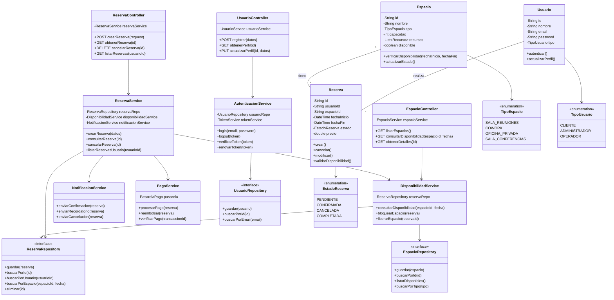

# Proyecto-Modulo-2-AC
## Descripción
Sistema de gestión de reservas desarrollado con arquitectura de microservicios en la nube (AWS), diseñado para permitir a los usuarios reservar espacios de manera eficiente, segura y escalable. El sistema maneja desde la autenticación de usuarios hasta el procesamiento de pagos y notificaciones automáticas.
### Problema que Resuelve
Las empresas necesitan gestionar eficientemente sus espacios compartidos (salas de reuniones, espacios de cowork, oficinas privadas) permitiendo a empleados y visitantes reservar recursos de forma simple y evitando conflictos de horarios.
### Solución
Plataforma cloud-native que ofrece:

- Reservas en tiempo real con validación de disponibilidad
- Sistema de pagos integrado
- Notificaciones automáticas
- Escalabilidad automática según demanda
- Alta disponibilidad (99.95% uptime)
- Seguridad enterprise-grade

## Características
### Funcionalidades Core
#### Autenticación y Autorización
Registro y login de usuarios
JWT tokens con refresh automático
Control de acceso basado en roles (RBAC)
Autenticación multifactor (MFA) opcional

#### Gestión de Espacios
CRUD completo de espacios
Categorización (sala de reuniones, cowork, oficina privada)
Búsqueda y filtrado avanzado
Gestión de recursos (proyector, pizarra, etc.)

#### Sistema de Reservas
Creación de reservas con validación en tiempo real
Prevención de conflictos de horario
Modificación y cancelación con políticas configurables
Historial completo de reservas
Cálculo automático de precios

#### Procesamiento de Pagos
Integración con Stripe
Múltiples métodos de pago
Procesamiento de reembolsos
Registro completo de transacciones

#### Sistema de Notificaciones
Confirmación inmediata de reservas
Recordatorios automáticos (24h antes)
Notificaciones de cambios
Soporte para email y SMS

### Características No Funcionales

- Performance: Tiempo de respuesta < 200ms (P95)
- Escalabilidad: Soporta 10,000+ usuarios concurrentes
- Seguridad: Encriptación end-to-end, cumplimiento GDPR
- Disponibilidad: 99.95% uptime con multi-AZ deployment
- Observabilidad: Logging centralizado, tracing distribuido
- CI/CD: Despliegues múltiples diarios sin downtime

## Diagrama de Clases 
El siguiente diagrama muestra la estructura de clases del sistema, incluyendo las entidades principales, servicios, repositorios y controladores:

### Descripción de Componentes

#### Entidades de Dominio
Usuario: Representa un usuario del sistema (cliente, administrador u operador)
Espacio: Define un espacio reservable (sala, cowork, etc.)
Reserva: Registra una reservación de espacio por un usuario

#### Servicios
AutenticacionService: Maneja login, logout y validación de tokens
ReservaService: Lógica de negocio para reservas
DisponibilidadService: Valida y gestiona disponibilidad de espacios
PagoService: Procesa transacciones de pago
NotificacionService: Envía notificaciones a usuarios

#### Repositorios
Interfaces que abstraen el acceso a datos
Implementaciones concretas para PostgreSQL

#### Controladores
Endpoints REST que exponen la funcionalidad
Validación de entrada y manejo de respuestas
